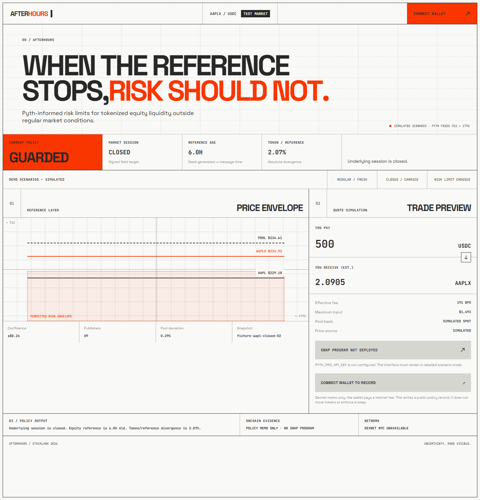

# AfterHours

AfterHours is an oracle-aware risk-policy prototype for tokenized equities. It compares a 24/7 token market with its Pyth equity reference, then illustrates how market session, feed age, confidence, and price divergence could change fees, trade limits, or a pause decision.



## Current build

- One-screen Next.js interface based on an original adaptation of Heron's architectural-utilitarian design system.
- Deterministic `open`, `guarded`, and `paused` risk decisions.
- Explicitly labelled regular, carried-forward, and hard-limit demo scenarios.
- Server-only Pyth Pro route for AAPL feed `922` and AAPLX feed `1792`.
- Strict Pyth response parser that requires both feeds and signed Solana payload bytes.
- Solflare/Phantom Wallet Standard connection on Solana devnet.
- Optional wallet-signed devnet memo that records the selected policy decision and links to its Explorer receipt.
- Nine passing tests covering policy boundaries, quote rejection, oracle-quality signals, price scaling, timestamps, and missing signatures.

**This prototype does not execute a swap or enforce policy onchain.** The swap action is disabled because no AMM program is deployed. The memo is a public devnet audit note only: it records a browser-computed decision, moves no tokens, and does not verify Pyth's signature. Market scenarios are simulations until a Pyth Pro key supplies a live response. The interface labels those sources.

## Run locally

```bash
npm install
copy .env.example .env.local
npm run dev
```

Add a Pyth Pro trial key to `.env.local` as `PYTH_PRO_API_KEY`. The key remains server-side. Then open `http://localhost:3000`. Without a key, the labelled scenarios still work. Connect a devnet wallet only if you want to record the optional testnet memo; it uses a small amount of devnet SOL for fees.

## Verify

```bash
npm run typecheck
npm test
npm run build
```

## Judge path

1. Compare the same USDC input under **Regular / fresh** and **Closed / carried**.
2. Observe the effective fee, maximum input, reference age, and stated policy reason change.
3. Select **Risk limit crossed** and confirm the quote and action are blocked.
4. Connect a devnet wallet and record the selected policy snapshot. Inspect the Explorer memo and verify that it is a record-only transaction; no token balance changes.

## Design attribution

The visual direction was informed by [Heron AI](https://heronaiapp.com/): square geometry, structural hairlines, technical typography, warm drafting-paper neutrals, and a vermilion action color. AfterHours uses original branding, copy, layout, diagrams, and licensed open fonts. No Heron logos, imagery, proprietary font files, or source assets are included.

See [PLAN.md](PLAN.md) for the roadmap, integration choices, trust boundaries, and demo sequence. [MODEL_ROUTING.md](MODEL_ROUTING.md) documents the suggested model allocation and the manual selection needed to apply it.
